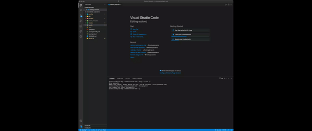
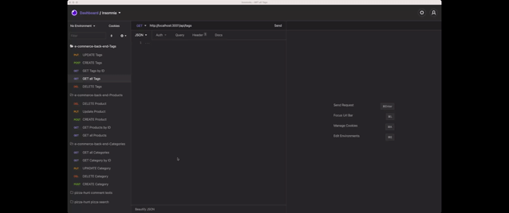
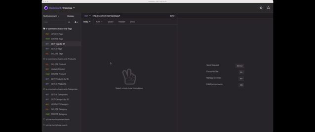

<h1 align="center">E-Commerce Back End</h1>
<p align="center">An Object-Relational Mapping (ORM) Demonstration</p>

<p align="center">
    
    
    
    
</p>
  
<p align="center">
    
    
    
    
    
</p>

## Discrption

Internet retail, also known as e-commerce, is the largest sector of the electronics industry, having generated an estimated US$29 trillion in 2017 (Source: United Nations Conference on Trade and Development). E-commerce platforms like Shopify and WooCommerce provide a suite of services to businesses of all sizes. Due to the prevalence of these platforms, developers should understand the fundamental architecture of e-commerce sites.

This application will demonstrate a back end build of an e-commerce site by taking a working Express.js API and configure it to use Sequelize to interact with a MySQL database. Because this application won’t be deployed, the [README.md](./) file will contain a walkthrough video that demonstrates its functionality.

## User Story

The following is an example of a how a user would like to use this application:

```
AS A manager at an internet retail company
I WANT a back end for my e-commerce website that uses the latest technologies
SO THAT my company can compete with other e-commerce companies
```

## Application Functioanlity

The following is the funcatioanlity that the application will consist of based on the users requests mentioned above:

```
GIVEN a functional Express.js API
WHEN I add my database name, MySQL username, and MySQL password to an environment variable file
THEN I am able to connect to a database using Sequelize
WHEN I enter schema and seed commands
THEN a development database is created and is seeded with test data
WHEN I enter the command to invoke the application
THEN my server is started and the Sequelize models are synced to the MySQL database
WHEN I open API GET routes in Insomnia Core for categories, products, or tags
THEN the data for each of these routes is displayed in a formatted JSON
WHEN I test API POST, PUT, and DELETE routes in Insomnia Core
THEN I am able to successfully create, update, and delete data in my database
```

## Demo Videos



Seeding and starting of the DB and server.

---



`GET` routes returning all Categories, all Products, and all Tags being tested in Insomnia Core.

---



`GET` routes to return a single Category, a single Product, and a single Tag being tested in Insomnia Core

---

Click this [link](https://drive.google.com/file/d/1NmMGa0ilBML55Q9gwJL5TepVixNS6f-Y/view) to see the full demo video on `POST`, `PUT`, and `DELETE` routes for Categories, Products, and Tags being tested in Insomnia Core.

---

## Installing Dependencies

Enter the following command to install the required Node Package Modules:

`npm i mysql2 sequelize dotenv`

## Running the Application

Enter the following command in your CLI at the root of the application

`mysql -u root -p`

Enter PW when promted

`source db/schema.sql`

`quit`

`npm run seed`

`npm start`

## Contibutions

[Kyle Wilson](https://github.com/lylekilson)
